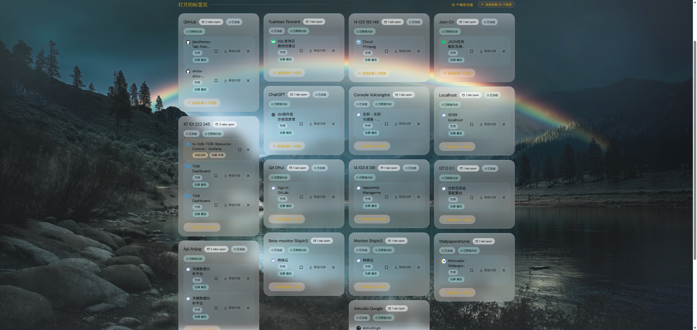

# Goo-Tab-Free

## 项目简介

**中文**

Goo-Tab-Free 是一个纯本地运行的 Chrome 扩展，它会接管浏览器的新标签页，把你当前打开的标签统一整理成一个可操作的仪表盘。它不是书签工具，也不是在线服务，而是一个专门帮助你快速理解“现在到底开了什么”的标签管理视图。

它会按域名自动分组，把 Gmail、X、YouTube、GitHub 这类首页型页面收纳到单独分组里；你可以直接跳转到目标标签、批量关闭同类页面、清理重复页，或者把暂时不想处理的内容保存到 “Saved for Later” 侧栏中。

**English**

Goo-Tab-Free is a fully local Chrome extension that replaces the default new tab page with an actionable dashboard of everything you already have open. It is not a bookmark manager and not a cloud service. It is a focused tab-management view that helps you understand your current browser state instantly.

The extension groups tabs by domain, pulls homepage-style tabs such as Gmail, X, YouTube, and GitHub into their own section, lets you jump back to any tab directly, clean up duplicates, close groups in batches, and save tabs to a “Saved for Later” sidebar before closing them.

---

## 核心特性 | Highlights

**中文**

- 按域名聚合当前标签，降低“开太多页看不清”的负担
- 将常见首页类页面收拢为单独分组，减少信息噪音
- 支持跨窗口定位并切回任意标签，不会额外新开页面
- 自动识别重复 URL，并提供一键去重能力
- 支持按组关闭标签，也支持逐个关闭
- 关闭标签时带有音效与彩纸动画，交互更有反馈感
- 提供 “Saved for Later” 列表，关闭前可先暂存页面
- 使用 `chrome.storage.local` 本地保存数据，不依赖服务器
- 对 `localhost` 标签展示端口信息，方便区分本地开发页面

**English**

- Groups open tabs by domain so overloaded tab sets become readable again
- Pulls common homepage-style tabs into a separate section to reduce noise
- Jumps directly to any tab across browser windows without opening a new one
- Detects duplicate URLs and supports one-click duplicate cleanup
- Supports both per-tab close and batch close for an entire group
- Adds sound and confetti feedback when closing tabs
- Includes a “Saved for Later” list so you can keep important pages before cleanup
- Stores data in `chrome.storage.local`, with no backend or account system
- Shows port information for `localhost` tabs so local projects are easier to distinguish

---

## 适用场景 | When It Helps

**中文**

如果你经常在研究资料、开发调试、处理消息和多窗口切换之间来回跳转，Goo-Tab-Free 适合你。它特别适合以下情况：

- 浏览器常驻几十个标签，但又不想一次性全部关掉
- 首页类网站很多，想快速批量清理
- 同一页面反复打开，导致重复标签堆积
- 想先把稍后再看的内容存起来，再做一次集中整理


**English**

Goo-Tab-Free is especially useful if your browsing pattern mixes research, development, messaging, and frequent multi-window switching. It works well when:

- you regularly keep dozens of tabs open but do not want to close everything blindly
- homepage-style sites pile up and need quick cleanup
- the same page gets opened multiple times during the day
- you want to save a few tabs for later before doing a larger cleanup pass

---

## Manual Setup

**1. Clone the repo**

```bash
git clone https://github.com/jiaozhenwu/goo-Tab-free.git
```

**2. Load the Chrome extension**

1. Open Chrome and go to `chrome://extensions`
2. Enable **Developer mode** (top-right toggle)
3. Click **Load unpacked**
4. Navigate to the `extension/` folder inside the cloned repo and select it

**3. Open a new tab**

You'll see Goo-Tab-Free.

---

## 使用方式 | How To Use

**中文**

安装完成后，打开一个新标签页即可进入 Goo-Tab-Free。主界面左侧展示当前打开标签的分组卡片，右侧展示你保存的稍后处理列表。你可以点击标签标题切回原页面，点击关闭按钮清理单个页面，或者直接对某个域名分组执行批量关闭与重复清理。

**English**

After loading the extension, open a new tab to enter Goo-Tab-Free. The main area shows grouped cards for your currently open tabs, while the right side displays your saved-for-later list. You can click any tab title to focus it, close individual tabs, or clean up an entire domain group in one action.

---

## 本地优先 | Local-First

**中文**

这个项目没有服务端、没有账号体系、没有远程 API，也不需要 Node.js 或额外构建流程。扩展依赖 Chrome Extension Manifest V3，并通过 `chrome.tabs` 和 `chrome.storage.local` 直接完成数据读取、页面跳转和本地存储。

**English**

There is no server, no account system, no remote API, and no Node.js build pipeline. The extension is built on Chrome Extension Manifest V3 and works directly with `chrome.tabs` and `chrome.storage.local` for reading browser state, focusing tabs, and persisting local data.

---

## 项目结构 | Project Structure

**中文**

- `extension/manifest.json`：扩展清单与权限声明
- `extension/index.html`：新标签页界面骨架
- `extension/app.js`：标签读取、分组、交互与本地存储逻辑
- `extension/style.css`：界面样式与动画效果
- `extension/background.js`：后台脚本

**English**

- `extension/manifest.json`: extension manifest and permission configuration
- `extension/index.html`: new-tab page structure
- `extension/app.js`: tab querying, grouping, interactions, and local storage logic
- `extension/style.css`: UI styling and motion effects
- `extension/background.js`: background service worker script

---

## 更新方式 | Updating

**中文**

拉取最新代码后，在 `chrome://extensions` 页面点击刷新即可完成更新。

**English**

Pull the latest code, then reload the extension from `chrome://extensions`.

---

## License

MIT

## 参考来源 | Reference

**中文**

原始项目参考来源：[Zara](https://x.com/zarazhangrui)

二次开发者：本项目当前维护者

**English**

Original project reference: [Zara](https://x.com/zarazhangrui)

Secondary development and current customization: this project maintainer
